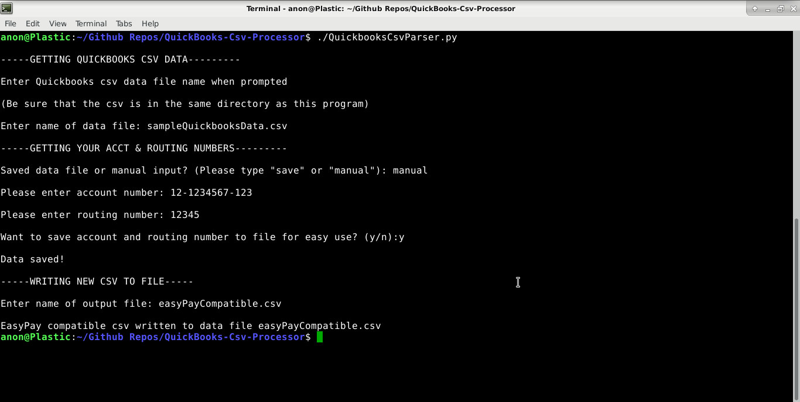
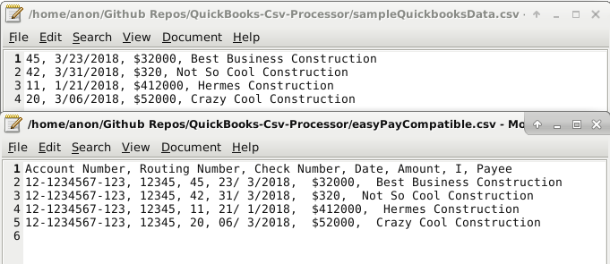

# Quickbooks-Csv-Processor

Data being converted from Quickbooks csv format to EasyPay-compatible csv format

-------------------------------------------------------------------------------- 

Comparison of Quickbooks csv data and EasyPay-compatible csv data

--------------------------------------------------------------------------------

TESTED ON DEBIAN STRETCH

Installation:

	Install Python 3:

	sudo apt-get install python3
	
	
Running Code:
	
	python3 QuickbooksCsvConverter.py
	
	
	OR
	
	
	./QuickbooksCsvConverter.py
	
	
	OR
	
	
	python3
	
	(entered shell)
	>>> import QuickbooksCsvConverter
	
	>>> QuickbooksCsvConverter.main()
	
	
	OR
	
	
	python3 -c 'from QuickbooksCsvConverter import *;  main()'
	
Follow the onscreen instructions to start converting your Quickbooks Csv into a format 

